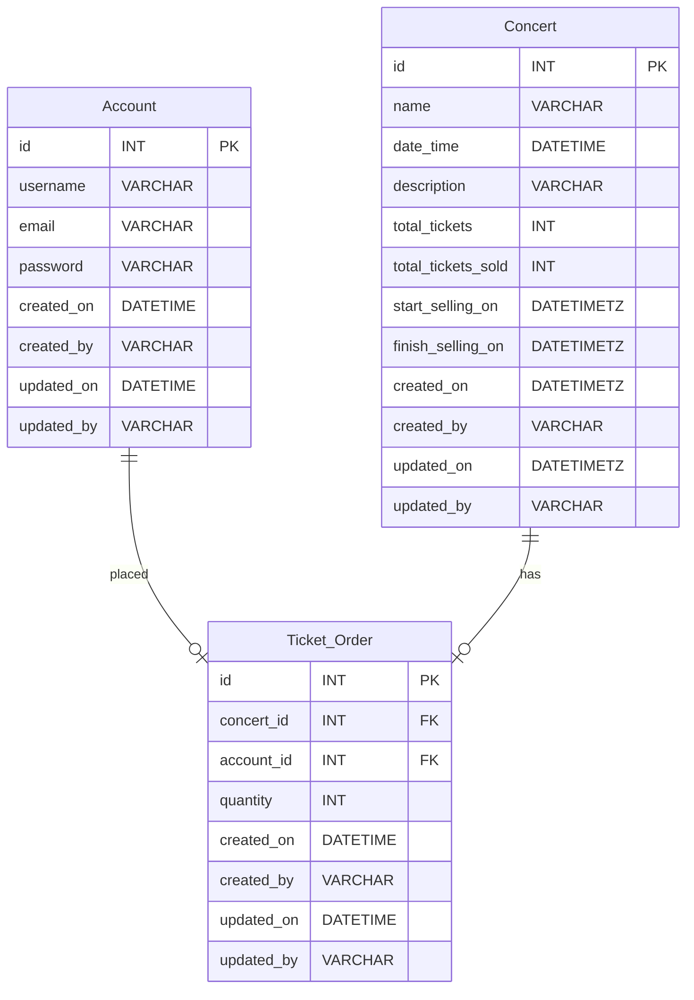

# Live Concert Service
## Technologies

List of technologies/libraries used in the project.

- Spring Boot
- Java
- Docker
- Postgres

## Features

- Filter Live Concert (P0)
- Booking Ticket (P0)
- User Authentication (P1: Will not implemented in this version)

### Prerequisites

List any software or tools that need to be installed.

- Java JDK
- Maven
- Docker

### Database Design



### Concert

- Represents a concert event.
- Attributes:
    - `id`: Primary Key.
    - `name`: Name or title of the concert.
    - `date_time`: Date and time of the concert.
    - `description`: Description or details about the concert.
    - `total_tickets`: Total number of available tickets for the concert.
    - `total_tickets_sold`: Number of tickets already sold for the concert.
    - `start_selling_on`: Date and time when ticket sales for the concert begin.
    - `finish_selling_on`: Date and time when ticket sales for the concert end.

### Ticket_Order

- Represents an order for tickets placed by a user.
- Attributes:
    - `id`: Primary Key.
    - `concert_id`: Foreign key referencing the concert for which tickets are ordered.
    - `account_id`: Foreign key referencing the account placing the order.
    - `quantity`: Number of tickets ordered.

## Relationships

- `Account` and `Ticket_Order`: Indicates that an account can place multiple ticket orders (`1 to many` relationship).
- `Concert` and `Ticket_Order`: Indicates that a concert can have multiple ticket orders placed (`1 to many`
  relationship).

### Installation

1. Clone the repository.
   ```sh
   git clone
2. Run Docker Compose.
   ```sh
   docker compose up -d

### API Documentation

* Postman Collection -> [here](result/Concert API.postman_collection.json)
* Performance Test Result -> [here](result/Concert-API-performance-report.html)

* Base URL - > http://localhost:8080/

| Name               | Get Concert List                                                                                                                                                  |
|--------------------|-------------------------------------------------------------------------------------------------------------------------------------------------------------------|
| Method             | GET                                                                                                                                                               |
| Headers            | Accept: application/json                                                                                                                                          |
| URL                | [/concert](http://localhost:8080/concert?page=0&size=10&startDate=2024-04-10)                                                                                     |
| Query Parameters   | - name (String) <br/> - concertStartDate (LocalDate, e.g., 2024-04-10) <br/> - concertEndDate (LocalDate, e.g., 2024-04-10) <br/> - page (Int) <br/> - size (Int) |
| Response Body      |                                                                                                                                                                   |
| ------------------ | ---------------------------------------------------------                                                                                                         |
| content            | Array of Objects                                                                                                                                                  |
|                    | - id: ID of Concert                                                                                                                                               |
|                    | - name: Name or title of the concert                                                                                                                              |
|                    | - description: Description or details about the concert                                                                                                           |
|                    | - totalTickets: Total number of available tickets for the concert                                                                                                 |
|                    | - totalTicketsSold: Number of tickets already sold for the concert                                                                                                |
|                    | - dateTime: Date and time of the concert in Millis                                                                                                                |
|                    | - startSellingOn: Date and time when ticket sales for the concert begin in Millis                                                                                 |
|                    | - finishSellingOn: Date and time when ticket sales for the concert end in Millis                                                                                  |

| Name               | Get Concert Detail                                                                |
|--------------------|-----------------------------------------------------------------------------------|
| Method             | GET                                                                               |
| Headers            | Accept: application/json                                                          |
| URL                | [/concert/{concertId}](http://localhost:8080/concert/1)                           |
| Path variable      | * concertId (ex: 1)<br/>                                                          |
| Response Body      |                                                                                   |
| ------------------ | ---------------------------------------------------------                         |
|                    | - id: ID of Concert                                                               |
|                    | - name: Name or title of the concert                                              |
|                    | - description: Description or details about the concert                           |
|                    | - totalTickets: Total number of available tickets for the concert                 |
|                    | - totalTicketsSold: Number of tickets already sold for the concert                |
|                    | - dateTime: Date and time of the concert in Millis                                |
|                    | - startSellingOn: Date and time when ticket sales for the concert begin in Millis |
|                    | - finishSellingOn: Date and time when ticket sales for the concert end in Millis  |

| Name             | Create Ticket Order                                                               |
|------------------|-----------------------------------------------------------------------------------|
| Method           | Post                                                                              |
| Headers          | Accept: application/json                                                          |
| URL              | [/ticket](http://localhost:8080/ticket)                                           |
| Request Body     |                                                                                   | 
| ---------------- | ---------------------------------------------                                     |
| id               | ID of Ticket Order                                                                |
| concertDetail    |                                                                                   |
|                  | - id: ID of Concert                                                               |
|                  | - name: Name or title of the concert                                              |
|                  | - description: Description or details about the concert                           |
|                  | - totalTickets: Total number of available tickets for the concert                 |
|                  | - totalTicketsSold: Number of tickets already sold for the concert                |
|                  | - dateTime: Date and time of the concert in Millis                                |
|                  | - startSellingOn: Date and time when ticket sales for the concert begin in Millis |
|                  | - finishSellingOn: Date and time when ticket sales for the concert end in Millis  |
| quantity         | Quantity Of Order                                                                 |
|
