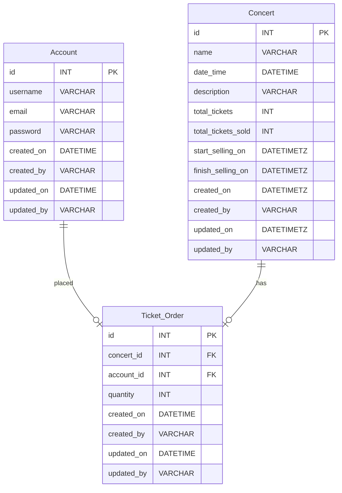

# Live Concert Service

## Table of Contents

- [Introduction](#introduction)
- [Technologies](#technologies)
- [Features](#features)
- [Getting Started](#getting-started)
    - [Prerequisites](#prerequisites)
    - [Installation](#installation)
- [Usage](#usage)
- [Contributing](#contributing)
- [License](#license)
- [Contact](#contact)

## Introduction

Provide a brief overview of the project. What does it do? Why was it created?

## Technologies

List of technologies/libraries used in the project.

- Spring Boot
- Java
- Docker
- Postgres

## Features

- User Authentication
- Filter Live Concert
- Booking Ticket

## Getting Started

Instructions for setting up the project locally.

### Prerequisites

List any software or tools that need to be installed.

- Java JDK
- Maven
- Docker

### Database Design



### Installation

1. Clone the repository.
   ```sh
   git clone
2. Run Docker Compose.
   ```sh
   docker compose up -d
   
